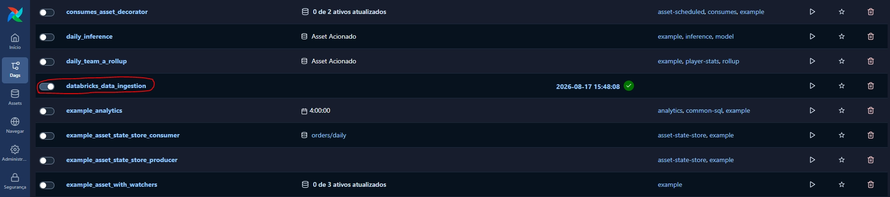

# Step 1 - Create environment

This part of the project focus on creating the airflow environment using docker compose inside WSL to later connect with Databricks and run the notebooks inside it. It was separated in several steps, being:

- Get the docker compose file for Airflow from the command

```bash
curl -LfO 'https://airflow.apache.org/docs/apache-airflow/3.3.1/docker-compose.yaml'
```

- Create the notebooks for ingestion, refinement and processing inside Databricks
- Initialize git locally to version the code
- Create all the airflow folders needed for the job to run. They are:
    - config
    - dags
    - logs
    - plugins

# Step 2 - Run the Airflow containers with Docker Compose

- After extracting the docker compose file from the airflow URL, if you are using BASH, you need to run the below command to create the necessary folders and to change the Airflow ID to be the same as your user ID

```bash
mkdir -p ./dags ./logs ./plugins ./config
echo -e "AIRFLOW_UID=$(id -u)" > .env
```

- Running this inside the airflow folder in the project will create the structure needed to run Airflow
- After creating these folders, create a .env file to store needed configuration variables for airflow. By default airflow try to look for specific variables inside .env file, other wise it will use default values to run the container

# Step 3 - Connect airflow with Databricks to run jobs

- To create a connection between Airflow and Databricks, first we need to create a Personal Access Token (PAT) and get the workspace url
- The steps to create a PAT are the following, go to your Databricks environment > profile > settings > developer > access tokens > manage
- The workspace URL can be obtained by right clicking the workspace folder inside workspace and then Copy URL/path > URL
- After creating the token, go to the Airflow UI page, located usually in the http://localhost:8080/ and follow these steps: Configurations > connections > add connection, in connection type select Databricks and add the password being the PAT and the workspace URL

# Step 4 - Create DAGS, Jobs and project structure

- The DAGS were created inside the python project and the ingestion step was made inside Databricks, to separate the responsibilities
- The job was created in the Jobs & Pipelines section in Databricks
- 

# Step 5 - Run the job through Airflow UI

- In the http://localhost:8080/, after logging in, in the Dags section, if the DAG is already created inside the dags folder, it’ll be possible to run the DAG inside the Airflow UI
